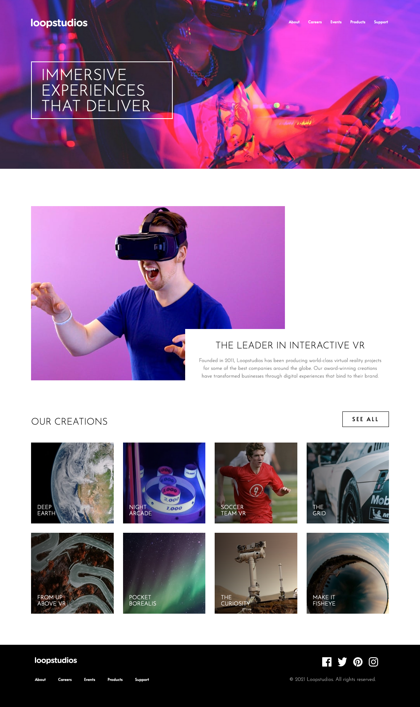

# Frontend Mentor - Loopstudios landing page solution

This is a solution to the [Loopstudios landing page challenge on Frontend Mentor](https://www.frontendmentor.io/challenges/loopstudios-landing-page-N88J5Onjw). Frontend Mentor challenges help you improve your coding skills by building realistic projects.

## Table of contents

- [Overview](#overview)
  - [The challenge](#the-challenge)
  - [Screenshot](#screenshot)
  - [Links](#links)
- [My process](#my-process)
  - [Built with](#built-with)
  - [What I learned](#what-i-learned)
  - [Continued development](#continued-development)
  - [Useful resources](#useful-resources)
- [Author](#author)
- [Acknowledgments](#acknowledgments)

**Note: Delete this note and update the table of contents based on what sections you keep.**

## Overview

### The challenge

Users should be able to:

- View the optimal layout for the site depending on their device's screen size
- See hover states for all interactive elements on the page

### Screenshot

### Links

- Solution URL: (https://jamgorilla.github.io/loopstudio-landing-page/)

## My process

### Built with

- Semantic HTML5 markup
- CSS custom properties
- Sass
- Flexbox
- CSS Grid
- Mobile-first workflow

**Note: These are just examples. Delete this note and replace the list above with your own choices**

### What I learned

- How to structure your scss into partials - putting in resets and all styles, fonts etc in root then seperating out nav footers and lists in components
- using mixins
- using grid
- using media quieries nested in the selector - still wondering the best way to organise this on a bigger scale with more media queries
- How to code a hamburger menu animation
- You can use "order" to change the order of HTML markup

### Continued development

Still not completely comfortable with the way of thinking about responsive layouts as well as how to organise them once you start to have 4 or 5 different break points
Still having problems with rendenring fonts and changing their weight especially if they are not variable
Want to start encorporating react and wordpress into fututure projects and use some more javascript

### Useful resources

Youtube - Kevin Powell, freecodecamp
Stack overflow

## Author

- Frontend Mentor - [@yourusername](https://www.frontendmentor.io/profile/yourusername)
